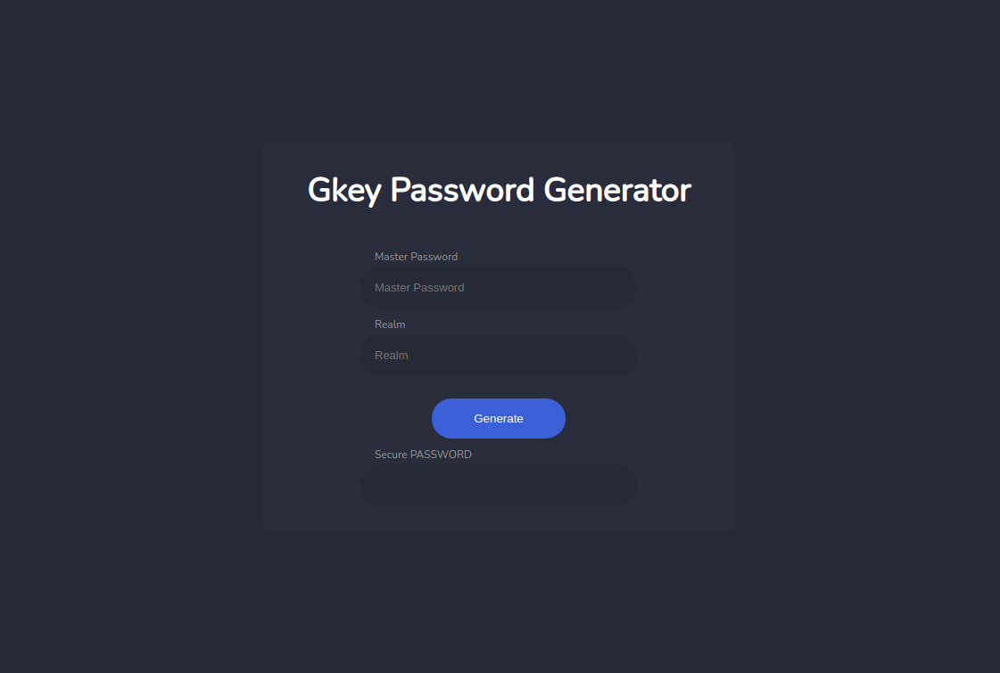

# Gkey UI with wasm

This ui generated for [Gkey](https://github.com/TheYkk/gkey) project. You can easily generate password with entering your **master password** and **realm**.




## Build and usage

To build you can use docker

```

docker build -t gkey-wasm:v0.0.1 .

```

To run 

```

docker run --rm -p 8080:8080 gkey-wasm:v0.0.1

```

If you don't want to waste time to build you can use pre built image


```

docker run --rm -p 8080:8080 theykk/gkey-wasm:v0.1.0

```